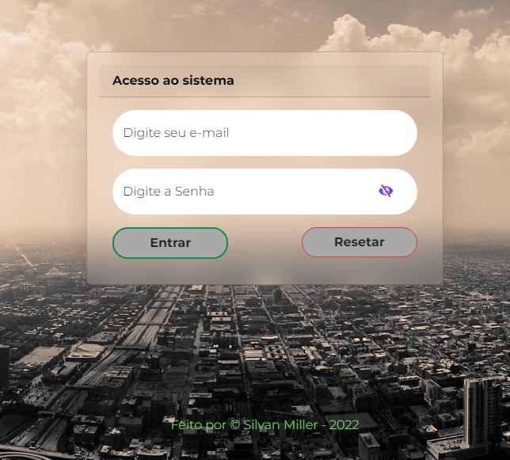

##### Criação de uma pagina de login com Bootstrap nesse processo acabei incluindo uma altenticação com REGEX

<h1 style = display: "inline block" align = "center" margin = "0px" >Silvan Miller estudante da Gama Academy! 👋</h1>
 

- 🧠 estamos hoje estudando **Bootstrap**, com professor **Professor Francis**

#### Como nosso primeiro exercício com **Bootstrap** criamos uma pagina de [login](../bootstrap/bootstrap_01/imgPrincipal.jpg), nessa pagina eu utilizei alterações diretamente nas classes do bootstrap com **CSS** e fazendo com [**REGEX**](https://regexr.com/) as validações no **JAVASCRIPT** e fora que vimos outras libs, para o **CSS** vimos a [**animate**](https://animate.style/) e para o **js** vimos o [**toastr**](https://codeseven.github.io/toastr/)e sei q vamos ver muitas mais é só o começo.

## Go Gama!!!!, Go Gama!!!!

